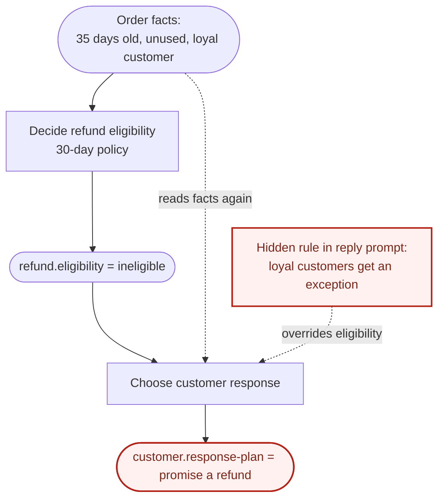
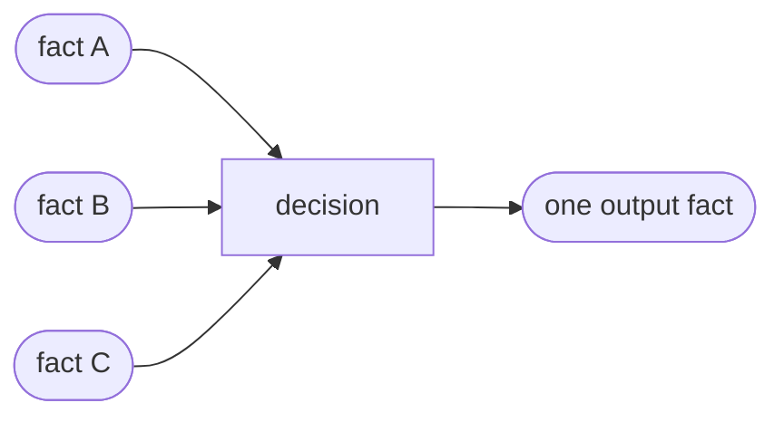
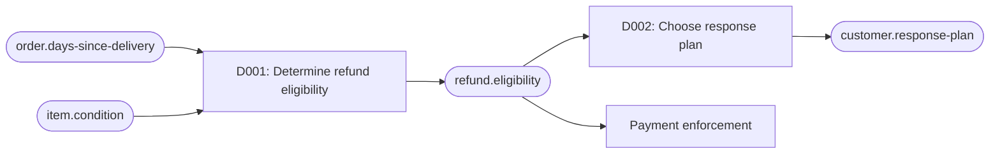
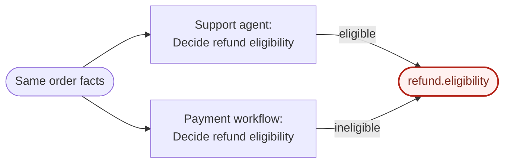
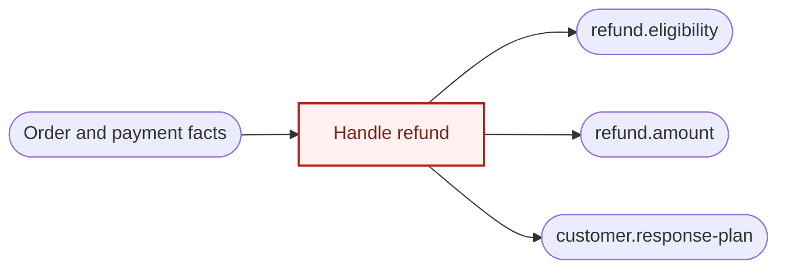
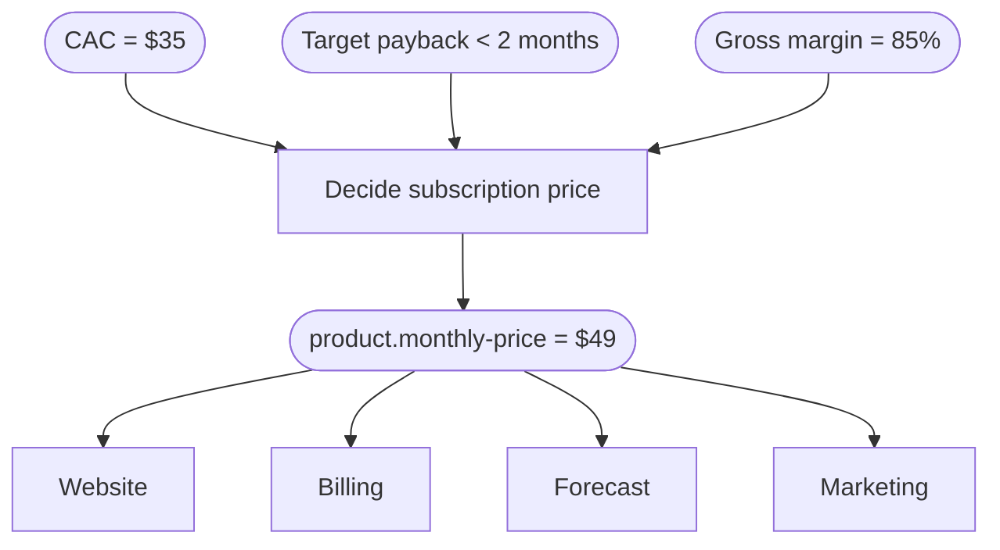

# Decision Engineering

We're all trying to build reliable systems of agents and humans, but making those systems reliable presents several challenges.

To address this, we've tried to provide more facts in context. We've linked our sources through MCP, built memory layers, and developed numerous ways to retrieve relevant facts.

Providing the right facts improves it, but it does not completely solve the problem. The judgments humans and agents make are fundamentally unreliable: they can reach different conclusions from the same facts, causing a different policies spread across prompts, code, and documents, that would make next run of the system much more unreliable.

So how do we build a reliable system from unreliable parts?

Building reliable systems from unreliable parts is a problem we have worked on for a long time. Thinkers such as Claude Shannon and John von Neumann explored it decades ago.

The core insight is this: you can build a reliable system from unreliable parts if it has enough error-correcting capacity to remove errors faster than they accumulate. Put simply, if you can locate a single point of error, you can correct it before it affects other parts of the system and preserve the system's reliability.

So the key to building a reliable system is not to prevent wrong judgment but to build a system that can recover from one.

Decision Engineering makes decision a first-class architectural object:

```text
goal → requirement → input facts → policies → one output fact
```

Each decision has one job, produces one authoritative result, and records the path from intent to behavior. Facts connect decisions into a dependency graph, so a wrong result has an owner and a visible blast radius.

## You need this if

- You're trying to build a reliable system of agents and humans
- Your agents give different answers to the same question with the same facts.
- You cannot say which prompt, file, or person owns a rule.
- Changing a policy means grepping for its copies and hoping you found them all.
- When an answer is wrong, you have nowhere specific to look.

## Three symptoms, one omission

Most systems record the outcomes of important judgments, but not the decisions that produced them.

For example, if you're running a company that sells software, the system can tell you that a refund is eligible, a subscription costs `$49`, or a feature is disabled, but cannot tell what led to these facts.

That omission surfaces three ways:

- **At execution time, judgment diverges.** The support agent and the payment workflow answer the same question differently.
- **At change time, intent disappears.** When the return window moves from 30 days to 45, nobody can say which prompts, code paths, and tests encode the old number.
- **After failure, the error has no address.** A wrong refund could come from the delivery date, the eligibility rule, the reply agent, or an exception someone applied by hand.

These are not three problems. They are consequences of storing the result of a judgment without representing the decision that owns and explains it.

### The failure that is hardest to see

The refund decision can be written down correctly and still be overridden downstream:



The dashed edges are dependencies that exist in behavior but not in any declared structure. The reply agent reads the original facts again and applies its own rule, quietly overriding the recorded answer. Updating the official policy will never reach that copy.

If this diagram describes something in your system, the rest of this document is for you.

## Quickstart

After installation, there is no setup step. Ask your agent to record a decision and the skill creates `decision-ledger/` at your project root, with a schema, an empty index, a log, and a graph.

Start by writing down one judgment your system already makes:

> Record how we decide whether an order is eligible for a refund.

Then use the ledger the way you would use any source of truth:

> Which decision owns `refund.eligibility`?

> We're changing the return window to 45 days. What does that affect?

> The reply promised a refund on an ineligible order. Trace it.

The skill routes each request before writing anything: consume an existing fact, edit the decision that owns it, create a decision only for a genuinely new question, or reconcile a bug or mismatch by tracing the observed behavior back through the authoritative decision path.

## Install

Choose one method. Using several creates several copies of the skill.

**Claude Code managed plugin**

```bash
claude plugin marketplace add hpark0011/decision-engineering --scope user
claude plugin install decision-engineering@decision-engineering --scope user
```

**Codex managed plugin**

```bash
codex plugin marketplace add hpark0011/decision-engineering
codex plugin add decision-engineering@decision-engineering
```

**Cursor Agent Plugin**

The repository root follows Agent Plugins 1.0, which Cursor loads directly. Import `hpark0011/decision-engineering` into a Cursor team marketplace, then install Decision Engineering at user scope from Customize. For local validation before a marketplace listing, clone the repository into `~/.cursor/plugins/local/decision-engineering` and restart Cursor.

**Editable skill with skills.sh**

```bash
npx skills@latest add hpark0011/decision-engineering
```

[skills.sh](https://skills.sh) copies the skill files into your project so you can review and customize them.

## What is a decision?

A decision is a named answer to a question the system must answer to make progress. It is a step that removes uncertainty.

A task is work to be performed. A decision is the conclusion that the work is meant to establish.

```text
Task:     Review whether this order qualifies for a refund.
Decision: Is this order eligible for a refund?
```

A decision reads authoritative input facts, applies one or more policies, and produces exactly one authoritative output fact.



This creates the central structural rule:

> One decision resolves one question and produces one authoritative fact.

A decision may read many facts and apply several policies. A fact may be read by many decisions. But every derived fact has exactly one producing decision.

### What counts as one fact?

A fact is the smallest authoritative proposition that can change independently.

This may be one fact:

```text
refund.eligibility = {
  state: "ineligible",
  reason: "outside the 30-day return window"
}
```

The reason explains the state and cannot change independently without misrepresenting it.

This is not one fact:

```text
{
  refund_eligible: false,
  refund_amount: 49,
  response_tone: "apologetic"
}
```

Those fields answer different questions. They change independently and need different policies and checks, so they belong to separate decisions.

When atomicity is unclear, ask:

1. Could one part change while the others remain valid?
2. Could one part be correct while another is wrong?
3. Could one part be useful without accepting the others?
4. Do the parts require different policies, invariants, or verification?

If any answer is yes, the output contains multiple facts and should be split.

## The ledger and the graph

Decision Engineering builds two things:

- A **Decision Ledger** records how each decision is intended to work.
- A **Decision Graph** records how facts and decisions depend on one another.

Together they form an authoritative decision system: a source of truth for why a choice was made, what must remain true, who owns the result, and how to check it.

### The ledger

Each record holds the smallest complete path from a requirement to one result:

| Element | What it records |
| --- | --- |
| Requirement | What must become true, without prescribing implementation. |
| Question | The one uncertainty being resolved. |
| Input facts | The authoritative root or derived facts the decision reads. |
| Invariants | What must remain true regardless of the answer. |
| Policy | How the inputs become an answer, including how multiple policies combine. |
| Output fact | The one result this decision owns. |
| Enforcement | The boundary that can reject an invalid action or state. |
| Verification | The checks that exercise the authoritative path. |

Invariants, enforcement, and verification are easy to confuse. For a refund: the **invariant** is that a 35-day order can never be eligible. **Verification** is the test proving day 30 passes and day 31 does not. **Enforcement** is the payment workflow refusing to move money when the recorded eligibility is not `eligible`. One states the constraint, one proves it holds, one stops it from being violated at runtime.

All three headings remain in every decision record. When one genuinely does not apply, the schema permits `Not applicable: <specific reason>` after review confirms that the exemption follows from the decision itself rather than from missing design, implementation, evidence, or tests. The exemption makes a limitation explicit; it does not claim that the absent safeguard exists.

The ledger is the source of truth for intent. Code remains the source of truth for behavior.

```text
decision ledger = what the system is intended to decide
code            = what the system actually does
```

A disagreement between them is a review flag, not proof that either side is right. The implementation may be wrong, or intent may have changed without being recorded. A human adjudicates which one should change.

### The graph

The graph has two node types, facts and decisions:

```text
fact --input-to--> decision --produces--> fact
```

A decision may have many incoming facts but exactly one outgoing fact. A derived fact has exactly one producing decision. A root fact has exactly one authoritative external writer or observation boundary.

```text
[external writer] → (root fact) → [decision] → (derived fact)
```

Chained, this gives a structure you can walk in both directions:

```text
fact → decision → fact → decision → fact
```

Walking upstream explains where an answer came from. Walking downstream shows what may be affected when it changes.

## Worked example: refund eligibility

Suppose the store adopts this requirement:

> Customers may receive refunds for unused items returned no more than 30 days after delivery. Missing or invalid information must go to review.

A compact decision record:

```markdown
---
status: active
domain: refunds
id: D001
title: "Determine refund eligibility"
updated_at: 2026-09-03
---

## Requirement

Eligible customers must be able to receive a refund without allowing
out-of-policy refunds to proceed.

## Question

Is this order currently eligible for a refund?

## Input facts

- `order.days-since-delivery`
  - Kind: root
  - Authority: order system
- `item.condition`
  - Kind: root
  - Authority: returns inspection

## Invariants

- An order more than 30 days past delivery cannot be marked eligible.
- Missing or invalid inputs cannot produce an eligible or ineligible result.

## Policy

- Missing or invalid inputs produce `needs_review`.
- Otherwise, an unused item returned within 0–30 days is `eligible`.
- All other cases are `ineligible`.

## Output fact

- Name: `refund.eligibility`
- Meaning: Whether the order currently satisfies the refund eligibility policy.
- Shape: `{ state: eligible | ineligible | needs_review, reason: string }`
- Atomicity: `reason` explains `state` and cannot vary independently.

## Enforcement

The payment workflow must reject refund execution unless
`refund.eligibility.state` is `eligible`.

## Verification

- Day 30 with an unused item is eligible.
- Day 31 with an unused item is ineligible.
- Day 30 with a used item is ineligible.
- Missing or invalid input produces needs-review.
- Refund execution rejects every non-eligible result.
```

The support agent and the payment workflow no longer decide eligibility independently. Both consume `refund.eligibility` from D001, and the reply agent consumes the recorded answer instead of re-reading the raw facts.



Now compare that with the first diagram in this document. The dashed override is gone, because `D002` has no reason to recompute the 30-day window. That question already has an owner.

And the failure modes have addresses:

- A 35-day request marked eligible → start at **D001**.
- Eligibility correctly ineligible but the reply promises a refund → start at **D002**.
- The delivery date was wrong → correct the root fact and re-evaluate the affected path.

More worked examples:

- [Product development: choosing and shipping a product bet](examples/product-development.md)
- [Public markets: making and managing an equity investment](examples/public-market-investment.md)

## Architecture

A minimal ledger is a directory of schema-constrained Markdown files:

```text
decision-ledger/
├── index.md
├── SCHEMA.md
├── log.md
├── decisions/
│   ├── D001-determine-refund-eligibility.md
│   └── D002-choose-response-plan.md
└── generated/
    └── graph.mmd
```

The files have distinct responsibilities:

```text
SCHEMA.md      = constitution of the ledger
                 record rules, invariants, and conventions

decisions/*.md = authoritative current decision records

index.md       = routing view over the decision records

log.md         = semantic history of decision changes

graph.mmd      = dependency view of facts and decisions
```

`SCHEMA.md` and `decisions/*.md` define the current decision system. The index and graph make those records fast to navigate but must never hold unique policy. The log explains what changed in the decision model, why, and what it affected.

The index routes primarily by output fact, because that is what a reader usually has in hand:

| Produces | ID | Decision | Reads | Domain | Status |
| --- | --- | --- | --- | --- | --- |
| `refund.eligibility` | D001 | Determine refund eligibility | `order.days-since-delivery`, `item.condition` | refunds | active |

Keep the decision files flat. Domain groupings belong in the index and graph, so stable decision identities do not depend on a folder taxonomy that will change.

For the maintained workflow and the exact record contract, see [SKILL.md](skills/decision-engineering/SKILL.md) and [SCHEMA.md](skills/decision-engineering/assets/decision-ledger/SCHEMA.md).

## Working with the ledger

### Locate before creating

When a requirement arrives, search the ledger before adding logic:

1. Does an existing decision already answer this question?
2. Does an existing output fact already represent the answer?
3. Is the requirement changing an existing policy, invariant, input, or output meaning?
4. What genuinely new uncertainty remains?

If an existing decision produces the required fact, consume it. If its answer should change, edit the owning decision. Only a genuinely new question creates a new record.

### Create or edit

To create a decision: state the requirement as an outcome, name the exact question, identify authoritative inputs and invariants and policies, define one atomic output fact, identify enforcement and verification, then record it and refresh the index and graph.

To change behavior: locate the decision that owns the affected fact, edit its record, then walk the graph downstream and update affected decisions, code, enforcement, and verification together. Append the semantic change to the log.

Prefer superseding or retiring an adopted decision over deleting it. Stable IDs may already be referenced by requirements, tests, commits, logs, or downstream decisions.

### Diagnose an error

Start from the observed behavior and walk backward:

```text
wrong observed output
    → authoritative output fact
    → producing decision
    → policy and invariants
    → input facts
    → producers or external writers
    → enforcement
    → verification
```

That localizes the error to a bounded set of causes: a root fact was wrong or stale, a derived input was produced incorrectly, the wrong authority wrote a fact, the policy was incomplete, enforcement was absent or bypassed, the implementation introduced hidden judgment, verification missed the case, or the recorded intent was simply wrong.

Do not patch the nearest visible surface before locating the fact and decision that own the answer.

### The correction threshold

Decision Engineering is not primarily documentation. Its purpose is to keep wrong answers localizable and correctable. A system stays correctable while all of these hold:

1. The observed output can be named as one fact.
2. Exactly one decision or external writer owns that fact.
3. That decision outputs only that fact.
4. Every input fact has one authority.
5. All applicable policies and how they combine are recorded together.
6. A boundary can reject an invalid result or transition.
7. Verification exercises that authoritative path.

When these break, an error stops telling you where its correction belongs. Local patches accumulate, policies drift, and every future change requires rediscovering the same reasoning.

A schema-approved not-applicable reason keeps the record structurally explicit, but it does not satisfy a safeguard that the system does not have. Include the exemption when reporting whether the system is below this correction threshold.

## Working with graph

Decisions rarely stand alone. Whether an order qualifies for a refund affects what we tell the customer. The graph makes that connection visible.

The core rule is:

**One decision → one authoritative output fact.**

Each result has one decision that owns it. Many other decisions can use that result, but they all get it from the same place. Facts from outside the system have named sources.

An output fact is simply a recorded answer, like `refund.eligibility = ineligible`. It can still be wrong. The useful part is knowing exactly where it came from.

Compare the graph with your code, prompts, and workflows. These three patterns are worth looking for.

### 1. Scattered responsibility

The support agent and the payment workflow each decide whether the same order qualifies for a refund.



Two decisions claim to own `refund.eligibility`. They disagree, and the rest of the system has no single answer to use.

### 2. Mixed responsibility

One decision decides eligibility, the refund amount, and what to tell the customer.



One decision owns three separate answers. Each needs its own rules and checks, but they're all bundled together.

### 3. Hidden coupling

The agent writing the reply quietly applies its own version of the refund policy. Here, the order is outside the 30-day window, but the reply agent makes an exception for a loyal customer.


The dashed links show dependencies missing from the declared graph. The reply agent reads the original facts and applies a local rule, overriding the recorded eligibility. Changing the official policy won't update that hidden copy.

Separate decisions that need separate rules or corrections. Putting several independent answers into one object doesn't make them one decision.

Different agents or people can carry out the same decision. They share its definition, and later steps use its recorded result.

When an answer turns out to be wrong, the graph shows where to start looking and which other answers may need another look. The checks and records help you find the cause.

## Human and agent roles

The human supplies intent, resolves normative ambiguity, approves policy choices, and adjudicates disagreements between the ledger and the implementation.

The agent locates existing decision ownership, proposes records, maintains references and views, traces impact, and verifies the artifacts against the project's schema.

```text
human  = supplies and adjudicates irreducible intent
agent  = proposes, maintains, traces, and verifies
system = constrains and enforces
```

## Where it fits in the agent stack

Most systems have somewhere to look up facts and state. The price is `$49`. A feature is disabled. The launch date is October 10. When it is time to change something, current state only gets you so far.

Imagine asking an agent to improve conversion. It sees `$49`. Maybe that price protects a margin target. Maybe an experiment showed `$39` performed worse. Maybe a customer contract is tied to it. Or maybe it was a guess someone made six months ago.

Those are very different reasons to keep or change the price, and the state does not say which applies. So the agent assembles an explanation from whatever context it can find, another agent assembles a different one, and each change looks reasonable while pulling the system in a different direction.



Decision Engineering preserves both layers:

```text
state  = what the system is
intent = why it is that way
```

If CAC rises from `$35` to `$70`, the new fact does not automatically make `$49` wrong. It identifies one specific decision to revisit and shows the downstream decisions that may need another look.

Your harness still runs the work: calling models and tools, managing context and state, handling retries, bringing in a person when needed. The ledger and graph give that work a shared definition of correct. Prompts, tests, runtime checks, and human reviews all refer to the same decision records. An agent uses them to make a choice, and the harness checks that choice before accepting the result or allowing an action.

When a check fails, the record tells you what was supposed to happen and the graph tells you what else may be affected. The harness can then retry the decision, ask for review, discard a stale result, or reverse an action where possible.

## Limitations

**It does not decide what is right.** A decision can be explicit, well-structured, and easy to verify while still being wrong because its facts or its judgment were wrong. Decision Engineering makes correction possible; it does not remove the need for judgment.

**Not every judgment should become a record.** Writing down every small choice makes the system slower and harder to use.

```text
Does another part of the system depend on this output?

No  → keep it local
Yes → make it explicit
```

**Some uncertainty is irreducible.** Sometimes there is not enough information to know the right answer. The system can still make that uncertainty visible, keep the decision reversible, and limit the damage when the judgment turns out to be wrong.

## Why this works

The expensive part of changing a system is usually not editing code. It is reconstructing the reasoning required to know what should change and how to prove the change is safe.

Decision Engineering makes that reasoning persistent and graph-shaped. Instead of searching prompts and code for scattered conditions, you start from the output fact and open its producing decision. Instead of discovering dependencies after a regression, the graph shows them before the change. Every accepted decision becomes a reusable node in the system's reasoning.

The result is a system whose important judgments have stable owners, whose facts have explicit authorities, and whose errors have bounded places to live.

## How I got here

Decision Engineering began with a question: how can we tell whether an agent understands a codebase well enough to change it safely? I first tried predicting implementation cost and treating misses as hidden surprise. In practice, token use varied too much across models and reasoning settings to be a trustworthy measure.

The more durable insight came from error-correcting systems: unreliable components can still produce a reliable whole when errors are detected and corrected faster than they spread. Decision Engineering applies that principle to human and agent judgment by making important decisions explicit so errors can be caught, contained, and corrected.

## Support

Report reproducible defects through [GitHub Issues](https://github.com/hpark0011/decision-engineering/issues). Use [GitHub Discussions](https://github.com/hpark0011/decision-engineering/discussions) for questions, ideas, and field reports.
