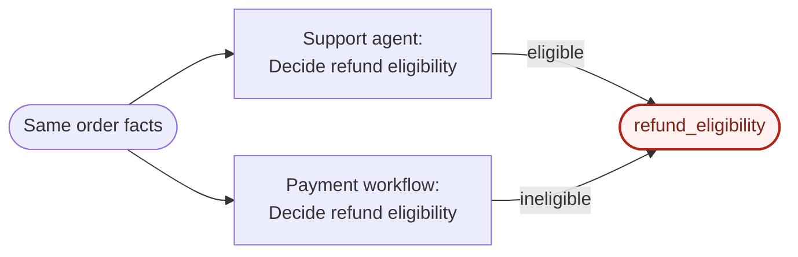
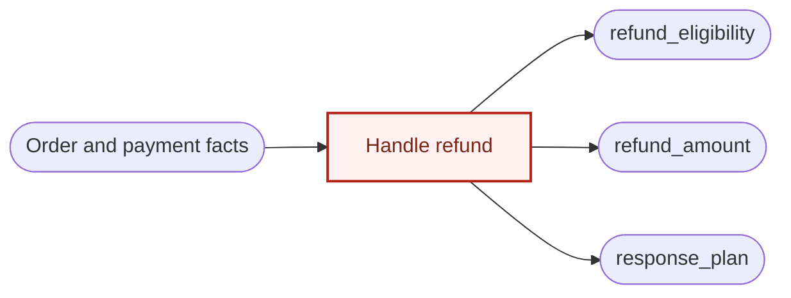
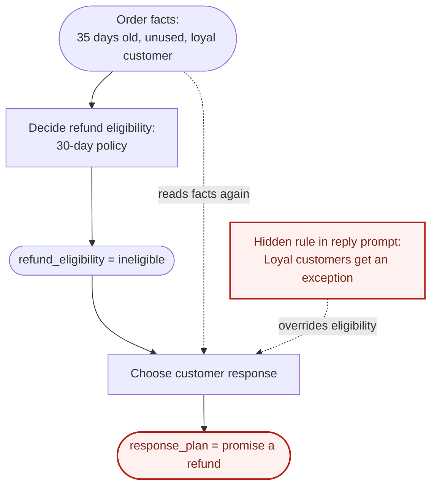
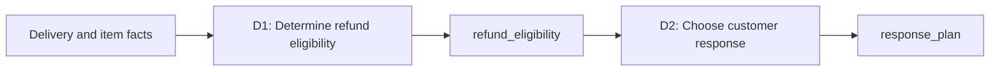

# Decision Engineering

An agent gets something wrong. So we give it more context: memory, tools through MCP, a longer prompt, better retrieval system, and so on.

More context can supply missing facts. But **agents, like humans, can still produce different judgments from same facts**. This is what makes challenging when building a reliable system that consists agents and humans.

Building reliable system out of unreliable parts is something that we've been doing for a while now and great thinkers like Claude Shannon and John von Neumann has already thought about this.

The core insight is this: You can build reliable system from unreliable parts if the system has enough error-correcting capacity to remove errors faster than they accumulate. To put more simply, if you can spot a single point of error, you can fix the error before the error impacts other part of the system, and maintain a reliable system.

So the key to building a reliable system is not to prevent wrong judgement, but to build a system that recovers from the wrong judgement. Targeted recovery requires knowing where a decision went wrong and what depends on it.

**Explicit decisions give errors an address.**

Decision Engineering is a way to build reliable systems from unreliable decision-makers. It puts decision as a first class object for deriving the architecture of the system. It makes decisions explicit, gives their outputs clear ownership, and connects them so failure in the system can be traced and corrected.

## Installation

Choose one installation method. If you use multiple method, you would have multiple copies of skills.

### 1. Claude Code managed plugin

```bash
claude plugin marketplace add hpark0011/decision-engineering --scope user
claude plugin install decision-engineering@decision-engineering --scope user
```

### 2. Codex managed plugin

```bash
codex plugin marketplace add hpark0011/decision-engineering
codex plugin add decision-engineering@decision-engineering
```

### 3. Cursor Agent Plugin

The repository root follows Agent Plugins 1.0, which Cursor loads directly. Import `hpark0011/decision-engineering` into a Cursor team marketplace, then install Decision Engineering at user scope from Customize. For local validation before a marketplace listing, clone the repository into `~/.cursor/plugins/local/decision-engineering` and restart Cursor.

### 4. Editable skill with [skills.sh](http://skills.sh)

[skills.sh](https://skills.sh) is a tool for adding agent skills to your project. It copies the skill files into your project so you can review and customize them.

```bash
npx skills@latest add hpark0011/decision-engineering
```

The skill maintains project ledgers by editing Markdown directly. See the [workflow](skills/decision-engineering/SKILL.md) and [default record contract](skills/decision-engineering/assets/decision-ledger/SCHEMA.md). This repository maintains those sources directly without a separate ledger for its own design.

## Problem

Imagine a customer asks for a refund. The order arrived 35 days ago. The item is unused. They've been buying from you for years.

One agent says, "They're a loyal customer. Let's give them a refund." Another says, "It's been over a month. We should decline."

Both have the same facts. What they don't share is a rule for deciding what matters more. More order history won't settle that.

We can put that rule in a prompt. But if the code follows a different rule, or someone remembers an exception that was never written down, we still have several versions of what's right.

Then a refund goes wrong, and we're searching through prompts, code, and conversations to figure out why.

## Core Principle

**Localize the error.**

Better models and better information can reduce mistakes. We still need a way to catch the ones that get through, limit the damage, and put things right.

That gets much easier when we can point to a decision, see the facts it used, and check the rule it followed. We can work out whether the facts were wrong, the rule was wrong, or the agent didn't follow it. Then we can see which later decisions used that result.

This is error localization. It gives us somewhere to investigate and tells us what we may need to redo. An explicit decision provides that starting point.

## How Decision Engineering Works

There are two things it builds:

- A **Decision Ledger** that spells out how each decision should work.
- A **Decision Graph** that shows how those decisions depend on one another.

Start with one workflow:

1. Find the decisions that change what happens next. Give each a name or ID.
2. Write down what each decision needs to know, which rules it follows, and how you'll check its answer.
3. Give each decision one result that it owns. Draw the links to every decision that uses that result.
4. Put those checks into the working system and keep a record of what happened.

You now have a place to look up what should happen, a map of what depends on it, and a way to compare that with what actually happened.

## Decision Ledger

Take a decision like "Is this order eligible for a refund?" The ledger puts everything needed to understand and check that decision in one place.

A ledger can contain multiple policies. One decision may apply several policies together: refund eligibility might depend on both a return-window policy and an item-condition policy. Those policies combine to produce one eligibility result.

| Element | What you write down |
| --- | --- |
| Requirement | What must become true, without prescribing the implementation. |
| Decision | The one uncertainty being resolved, in the form of a question. |
| Input facts | The authoritative root or derived facts the decision reads. |
| Invariants | What must remain true regardless of the answer. |
| Policy | One or more policies that turn the input facts into an answer, including how they combine. |
| Output fact | The one result this decision owns. |
| Verification | The checks that exercise the policies, their interactions, and invariants. |
| Enforcement | The boundary that can reject an invalid action or state. |

For a refund, verification can catch an approval that breaks the applicable policies. Enforcement stops that approval from turning into a payment. Both should refer to the same policies and combination rules in the ledger.

Keep versions of the decision definitions. Each time a decision runs, record its ID, the version it used, the input facts, the answer, and the checks. When something goes wrong, you can follow what happened.

The rule itself can be wrong, too. Having it written down gives everyone a place to question it and make a correction.

## Decision Graph

Decisions rarely stand alone. Whether an order qualifies for a refund affects what we tell the customer. The graph makes that connection visible.

The core rule is:

**One decision → one authoritative output fact.**

Each result has one decision that owns it. Many other decisions can use that result, but they all get it from the same place. Facts from outside the system have named sources.

An output fact is simply a recorded answer, like `refund_eligibility = ineligible`. It can still be wrong. The useful part is knowing exactly where it came from.

Compare the graph with your code, prompts, and workflows. These three patterns are worth looking for.

### 1. Scattered responsibility

The support agent and the payment workflow each decide whether the same order qualifies for a refund.



Two decisions claim to own `refund_eligibility`. They disagree, and the rest of the system has no single answer to use.

### 2. Mixed responsibility

One decision decides eligibility, the refund amount, and what to tell the customer.



One decision owns three separate answers. Each needs its own rules and checks, but they're all bundled together.

### 3. Hidden coupling

The agent writing the reply quietly applies its own version of the refund policy. Here, the order is outside the 30-day window, but the reply agent makes an exception for a loyal customer.



The dashed links show dependencies missing from the declared graph. The reply agent reads the original facts and applies a local rule, overriding the recorded eligibility. Changing the official policy won't update that hidden copy.

Separate decisions that need separate rules or corrections. Putting several independent answers into one object doesn't make them one decision.

Different agents or people can carry out the same decision. They share its definition, and later steps use its recorded result.

When an answer turns out to be wrong, the graph shows where to start looking and which other answers may need another look. The checks and records help you find the cause.

## Example: A Refund Decision

Let's give the store a simple policy: unused items qualify for a refund within 30 days of delivery. Missing or invalid information goes to review.

Here's a short ledger entry for `D1: Determine refund eligibility`:

- **Facts:** days since delivery and whether the item is unused, with a source for each.
- **Invariant:** an order outside the 30-day window can't be marked eligible.
- **Policy:** missing or invalid inputs return `needs_review`. Otherwise, unused items at 0–30 days return `eligible`; all other cases return `ineligible`.
- **Output:** `refund_eligibility`.
- **Verification:** check the answer against the facts and policy. Test an unused item at the boundary: day 30 qualifies, day 31 doesn't.
- **Enforcement:** block answers that break the rules and send the request to review before a refund goes through.

The next decision uses that answer to choose a response:



`D2` uses `refund_eligibility` to choose an approval, decline, or review response. It has no reason to calculate the 30-day window again. That decision already has an owner.

If the 35-day request is marked eligible, start with `D1`. If it's correctly marked ineligible but the reply promises a refund, start with `D2`. If the delivery date was wrong, fix that fact and run the affected decisions again.

Each case gives us somewhere specific to look and a way to work out what needs fixing.

## Where It Fits in the Agent Stack

Most systems have a place to look up facts and state. The price is $49. A feature is disabled. The launch date is October 10. But when it's time to change something, knowing the current state only gets you so far.

Imagine asking an agent to improve conversion. It sees that the price is $49. Maybe that price protects a margin target. Maybe a previous experiment showed that $39 performed worse. Maybe a customer has a contract tied to it. Or maybe $49 was a guess someone made six months ago.

Those are very different reasons to keep the price or change it. The current state doesn't tell you which applies. So the agent pieces together an explanation from whatever context it can find. Another agent may piece together a different one. Each change can look reasonable on its own while pulling the system in a different direction.

**Decision Engineering gives people and agents a shared place to look up the decision and the reasoning behind it.** The ledger records the facts it used, the policies it followed, and the conditions its result must satisfy. Requirements guide those rules. The graph connects the result to the decision that produced it and to the decisions that use it.

`Requirements + input facts + policies → Decision → Output fact`

For the pricing decision, customer acquisition cost (CAC) might have been $35, and the team might have required that acquisition cost be recovered within two months. The decision record keeps those inputs alongside the costs and pricing test results used to choose $49. If CAC rises to $70, there's a specific decision to revisit. The graph shows which later decisions depend on its result.

A changed input calls for another look. It doesn't automatically make the old price wrong. It gives the team a place to check whether the original choice still meets its requirements.

Your harness still runs the work: calling models and tools, managing context and state, handling retries, and bringing in a person when needed. The ledger and graph give that work a shared definition of correct. Together, they form an **authoritative decision system: the source of truth for why a choice was made, what must remain true, who owns the result, and how to check it.**

Prompts, tests, runtime checks, and human reviews all refer to those same decision definitions. An agent can use them to make a choice, and the harness can check that choice before accepting the result or allowing an action.

When a check fails, the decision definition and execution record give you a place to investigate. The graph shows which other results may be affected. The harness can then retry the decision, ask for review, discard an outdated result, or reverse an action where possible.

When the rule itself needs to change, update its ledger entry and the checks that enforce it together. Use the graph to find which decisions need another look. People and agents can then make that change from the same reasoning.

## Limitation

1\) Decision Engineering doesn't tell you what the right decision is.

A decision can be perfectly documented, clearly separated, and easy to verify, and still be wrong because the facts were wrong or the judgment was bad.

2\) Writing down every small decision would make the system slower and harder to use.

The challenge is deciding which decisions are important enough to make explicit and which ones can stay informal.

We could use the decision engineering framework to make this explicit so there isn't disagreeing judgement.

**A decision must be made explicit when its result becomes an input to another decision or another part of the system.**

```
Does another decision depend on this output?

No  → keep it local
Yes → make it explicit
```

3\) Decision Engineering can't completely remove uncertainty.

Sometimes there simply isn't enough information to know what the right answer is. In decision engineering, this is called irreducible uncertainties. In those cases, the system can make the uncertainty visible, keep the decision easy to change, and limit the damage if the decision turns out to be wrong.

## How I got here

Decision engineering was born from the thought "can I measure agent's level of understanding of the codebase?".

My answer to this question was this. If agent can predict how much token it would cost to meet the user's requirement, it means the agent has full understanding of the codebase. In other words, I would have agent predict the token cost during the planning phase, and measure the delta of the prediction and real token usage after agent has implemented the plan. The delta would be the surprise that agent didn't expect to account when it was making the prediction and if I fix what caused the delta, it means that agent has a full understanding of the system and it's able to predict how much token it would cost to make a change in the system.

So I created a skill and tested this but in practice, there were too many variables that agent had to account to make the right prediction. Each model, thinking level, would impact the token cost and when I asked agent what caused the prediction delta and agent gave me the reason, many of the reasons were hard to verify.

However, digging into this idea brought me to the information theory and other ideas that is built on top of the information theory.

The core insight of Claude Shannon's information theory, John von Neumann's cellular automata, and threshold theorem is: You can build reliable system from unreliable parts if the system has enough error-correcting capacity to remove errors faster than they accumulate.

Decision engineering adopts this insight as well. Agents work probabilistically so they are unreliable. If the parts of the systems can self correct when agent makes an error, we can still create an reliable system.

## 