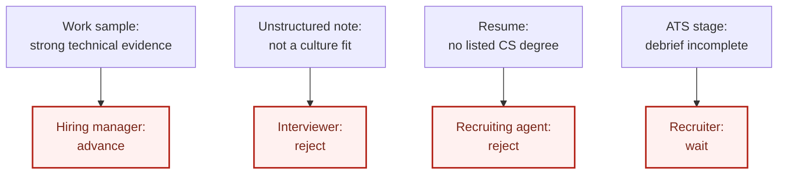
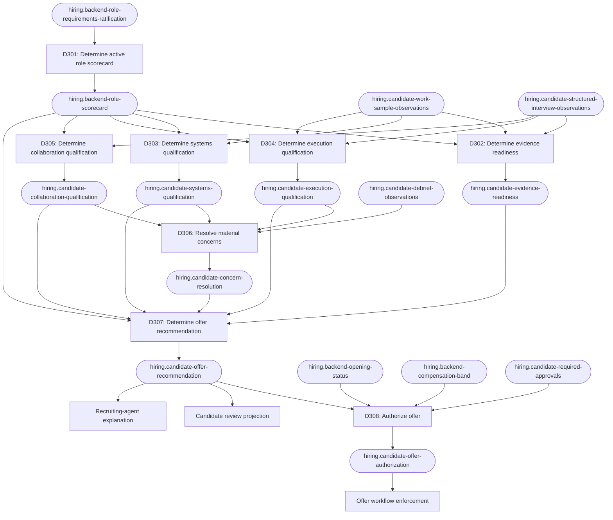

# Hiring: moving a candidate from evidence to offer

This example follows a hiring team from scattered interview feedback to an accountable
offer recommendation. It shows how Decision Engineering separates role requirements,
evidence completeness, competency judgments, disagreement resolution, offer
recommendation, and offer authorization.

The company, role, candidate, evidence, and outcomes are fictional. This example is
about decision architecture, not employment or legal advice. A real hiring system must
be reviewed against the laws, policies, accessibility requirements, and collective
agreements that apply to the organization and candidate.

## The situation

Relay is hiring a Senior Backend Engineer. Candidate `C-104` has completed a work
sample and a structured interview loop.

The evidence appears contradictory:

- The work-sample reviewers find strong systems design and debugging skills.
- The hiring manager believes the candidate can own production services.
- One interviewer writes "not a culture fit" without linking the concern to an
  observed behavior or a declared role requirement.
- A recruiting agent notices that the candidate does not list a computer-science
  degree, although the approved role scorecard does not require one.
- The recruiter wants a quick answer because another company may make an offer.

Different tools and people can now produce different outcomes from the same process:

- The interview packet says `strong hire`.
- The recruiting agent says `reject`.
- The hiring manager says `advance immediately`.
- The applicant-tracking system still says `debrief incomplete`.

The behavior-shaping question is:

> Should the accountable hiring panel recommend candidate C-104 for an offer for this
> role now?

## Before: every participant carries a private hiring bar

Without an authoritative decision, each participant turns a partial observation into
a final judgment:



The work sample, interview note, resume, and process state are inputs. None should
independently own the offer recommendation. If every participant carries a private
definition of "qualified," the answer changes with the reviewer, tool, or prompt.

## Requirement

> Every candidate must be evaluated by an accountable human panel against the same
> predeclared, job-related requirements using complete, attributable evidence. Missing,
> conflicting, or out-of-policy evidence must not silently become a positive or
> negative recommendation.

This requirement does not prescribe a particular candidate outcome. It defines what
must be true for the hiring decision to be valid.

## Decompose "should we hire this person?"

The apparent yes-or-no question contains several independently changeable decisions:

| Decision | Question | Output fact |
| --- | --- | --- |
| D301 | Which version of the role scorecard is active for this hiring process? | `hiring.backend-role-scorecard` |
| D302 | Is the required candidate evidence complete and attributable? | `hiring.candidate-evidence-readiness` |
| D303 | Does the evidence meet the systems-design requirement? | `hiring.candidate-systems-qualification` |
| D304 | Does the evidence meet the execution and operational-judgment requirement? | `hiring.candidate-execution-qualification` |
| D305 | Does the evidence meet the role's collaboration requirement? | `hiring.candidate-collaboration-qualification` |
| D306 | Have material evidence conflicts and concerns been resolved? | `hiring.candidate-concern-resolution` |
| D307 | Should the accountable panel recommend this candidate for an offer? | `hiring.candidate-offer-recommendation` |
| D308 | May the organization extend the approved offer now? | `hiring.candidate-offer-authorization` |

The separation matters:

- Evidence completeness is not evidence quality. Missing evidence produces review,
  not an automatic rejection.
- A competency assessment answers one job-related question; it is not the final hiring
  recommendation.
- A qualified candidate may not yet have an authorized offer if the opening, budget,
  compensation band, or required approvals are unresolved.
- Hiring urgency does not change the qualification bar.
- An agent may organize and summarize evidence without owning the human judgment.

## The decision graph

Each decision reads the facts it needs and produces one fact for downstream consumers:



The applicant-tracking system, candidate review view, and recruiting agent consume the
recommendation. They do not reconstruct it from resumes, interview snippets, or stage
labels.

The IDs are illustrative. Fact names describe the decision type; operational values
are scoped to a candidate identifier such as `C-104`. The ledger holds the reusable
policy, not a separate policy record or case file for every applicant. A real project
must locate existing decisions and facts before creating new records.

## Give each input a narrow authority

Authority is attached to a particular fact, not to an entire document or person.

| Fact | Example authority or observation boundary | Does not own |
| --- | --- | --- |
| Active role requirements and rubric version | Ratified role-scorecard process | Candidate outcome |
| Work-sample behavior | Trained work-sample observation process | Final competency judgment |
| Interview behavior | Structured interview observation process | Unrelated traits or inferred personality |
| Process completeness | Applicant-tracking workflow state | Qualification |
| Approved opening | Headcount authorization system | Candidate merit |
| Compensation constraints | Approved compensation-band authority | Whether the candidate meets the role bar |
| Offer approval | Accountable hiring authority | New qualification criteria |

An interviewer owns an attributable observation such as "the candidate identified the
failure mode but did not propose a safe migration." The interviewer does not own a
free-floating final label that bypasses the active scorecard.

Candidate-specific records should use access controls, retention rules, and the minimum
identifying information the process requires. This example uses `C-104` rather than a
person's name.

## Illustrative role bar and evidence

The active fictional scorecard is version 3. It declares three must-have competencies:

| Competency | Predeclared bar | C-104 evidence |
| --- | --- | --- |
| Systems design | Can design a resilient service and explain failure tradeoffs | Met in the work sample and systems interview |
| Execution and operational judgment | Can diagnose production failures and choose a safe recovery path | Met in debugging exercise and incident discussion |
| Collaboration | Can communicate technical tradeoffs, seek missing context, and disagree constructively | Met in cross-functional scenario interview |

The scorecard lists distributed-database experience as preferred, not required. It
does not require a computer-science degree. The organization does not recognize
unstructured "culture fit" as a decision criterion.

The upstream decisions produce:

| Output fact | State | Reason |
| --- | --- | --- |
| `hiring.candidate-evidence-readiness` | `ready` | Required exercises and attributable observations are complete |
| `hiring.candidate-systems-qualification` | `met` | Evidence meets the version-3 systems bar |
| `hiring.candidate-execution-qualification` | `met` | Evidence meets the version-3 execution bar |
| `hiring.candidate-collaboration-qualification` | `met` | Structured evidence meets the version-3 collaboration bar |
| `hiring.candidate-concern-resolution` | `resolved` | The culture-fit label had no job-related supporting observation and was excluded from the decision |

Excluding an unsupported label does not mean suppressing negative evidence. A concrete,
job-related concern would be routed to the appropriate competency decision and assessed
under the same policy applied to every candidate.

## The central decision record

D307 is owned by the accountable human hiring panel. Software can enforce completeness,
route evidence, detect mismatched rubric versions, and present the decision surface,
but it does not silently become the decision maker.

```markdown
---
status: active
domain: hiring-selection
id: D307
title: "Determine candidate offer recommendation"
updated_at: 2026-09-04
---

## Requirement

Every candidate must be evaluated by an accountable human panel against the same
predeclared, job-related requirements using complete, attributable evidence. Missing,
conflicting, or out-of-policy evidence must not silently become a positive or negative
recommendation.

## Question

Should the accountable hiring panel recommend the candidate under review for an offer
for the Senior Backend Engineer role under the active role scorecard?

## Input facts

- `hiring.backend-role-scorecard`
  - Kind: derived
  - Produced by: D301
- `hiring.candidate-evidence-readiness`
  - Kind: derived
  - Produced by: D302
- `hiring.candidate-systems-qualification`
  - Kind: derived
  - Produced by: D303
- `hiring.candidate-execution-qualification`
  - Kind: derived
  - Produced by: D304
- `hiring.candidate-collaboration-qualification`
  - Kind: derived
  - Produced by: D305
- `hiring.candidate-concern-resolution`
  - Kind: derived
  - Produced by: D306

## Invariants

- Only the accountable human hiring panel may commit the recommendation.
- Every competency conclusion uses the same active role-scorecard version.
- Only declared, job-related requirements and attributable evidence may affect the
  result.
- Missing evidence cannot be treated as negative evidence.
- Preferred qualifications cannot be silently promoted to required qualifications.
- Attributes prohibited by the organization's hiring policy, and unapproved proxies
  for them, cannot be decision inputs.
- Urgency, referral status, educational prestige, or an unsupported culture-fit label
  cannot override the declared role bar.

## Policy

- If the evidence is incomplete, any competency fact uses a different scorecard
  version, or a material concern remains unresolved, return `needs_review`.
- If any declared must-have competency is `not_met`, return `do_not_recommend`, citing
  the unmet job-related requirement in the reason.
- If every must-have competency is `met`, evidence is ready, and material concerns are
  resolved, the accountable panel may return `recommend`.
- Preferred qualifications may add context but cannot compensate for an unmet
  must-have requirement or cause rejection when absent.
- Ignore an undeclared or prohibited input and flag its attempted use for process
  review; do not let it affect the recommendation.

Apply incompleteness and conflict handling before evaluating a positive or negative
recommendation. The panel records its accepted result only after reviewing the linked
evidence and any excluded input flags.

## Output fact

- Name: `hiring.candidate-offer-recommendation`
- Meaning: Whether the accountable hiring panel recommends the candidate under review
  for an offer under the active Senior Backend Engineer scorecard.
- Shape: `{ state: recommend | do_not_recommend | needs_review, reason: string }`
- Atomicity: `reason` explains the recommendation state and cannot change independently
  without misrepresenting it.

## Enforcement

The hiring-decision boundary must reject committing a recommendation from an actor
other than the accountable human panel. It must reject `recommend` and
`do_not_recommend` when evidence is not ready, competency facts reference different
scorecard versions, or material concerns remain unresolved. The offer workflow must
reject advancement unless D308 separately produces an authorized offer.

## Verification

- Return needs-review when required evidence is incomplete rather than treating the
  absence as negative evidence.
- Return needs-review when competency facts were produced under different scorecard
  versions.
- Return needs-review while a material job-related concern remains unresolved.
- Return do-not-recommend when any declared must-have competency is not met.
- Permit recommend only when all must-have competencies are met, evidence is ready,
  and concerns are resolved.
- Verify that absence of a preferred qualification does not cause rejection.
- Verify that an undeclared degree requirement or unsupported culture-fit label cannot
  alter the result.
- Reject attempts by an agent, interviewer, recruiter, or hiring manager acting alone
  to commit the panel-owned fact.
- Reject offer advancement without a separately authorized D308 result.
```

With the illustrative inputs, the human panel produces:

```text
hiring.candidate-offer-recommendation[C-104] = {
  state: recommend,
  reason: "Complete evidence meets every version-3 must-have competency; the unsupported culture-fit label was excluded."
}
```

This does not itself create or authorize an offer.

## Authorize the offer separately

D308 asks whether the organization may extend the offer now. It reads the panel-owned
recommendation together with the approved opening, compensation constraints, and
required organizational approvals.

```text
hiring.candidate-offer-authorization[C-104] = {
  state: authorized,
  reason: "C-104 is recommended, the opening remains approved, and the proposed offer fits the authorized band and approvals."
}
```

Keeping D307 and D308 separate prevents headcount or compensation constraints from
being misrepresented as evidence that a candidate is unqualified. It also prevents a
positive qualification decision from bypassing organizational authorization.

## Record the decision model's semantic change

Creating D307 changes the system's intended hiring architecture, so it receives a
semantic log entry:

```markdown
## [2026-09-04] create | D307 | Determine candidate offer recommendation

Reason:
Interviewers, recruiters, managers, and agents could independently turn partial
evidence into conflicting offer recommendations.

Changed:
- Added D307 producing `hiring.candidate-offer-recommendation`.
- Declared the active scorecard, evidence readiness, three competency facts, and
  concern resolution as inputs.
- Assigned commitment of the recommendation to the accountable human hiring panel.
- Separated offer recommendation from D308 offer authorization.

Affected:
- `hiring.candidate-offer-recommendation`
- D308 — Authorize candidate offer
- Hiring-decision and offer-workflow enforcement
- Candidate review projection
- Recruiting-agent explanation
- D307 policy-branch, authority, and enforcement verification
```

The ledger index and graph are refreshed from the accepted decision records. Candidate
evidence values and outcomes belong in appropriately protected operational or audit
records; they are not semantic ledger edits unless the decision model changes.

## Handle disagreement without hiding it in an average

Interview disagreement contains information. D306 should not erase it by averaging
scores until the result looks decisive.

Instead, the resolution process asks:

1. Do the reviewers disagree about an observed event or about how the rubric applies?
2. Is each claim attributable to evidence from a declared assessment?
3. Which competency decision owns the disputed judgment?
4. Does the active policy resolve the conflict, or does it require more evidence?
5. Who has authority to adjudicate the remaining question?

Reviewers should record independent observations before the debrief where practical,
so one confident opinion does not silently rewrite everyone else's evidence. The panel
can resolve a conflict, request another job-related assessment, or return needs-review.
It should not invent a new criterion for one candidate.

## Consume the recommendation without re-deciding it

Downstream systems use D307's output for its declared meaning:

| Consumer | Correct responsibility | Must not do |
| --- | --- | --- |
| Candidate review view | Project the recommendation, rationale, scorecard version, and decision owner | Compute a second recommendation |
| Recruiting agent | Summarize status and route missing evidence | Infer qualification from resume keywords |
| Offer-authorization decision | Combine the recommendation with operational approvals | Re-score candidate competencies |
| Offer workflow | Enforce D308's authorization | Treat an interviewer's label as authorization |
| Candidate communication | Communicate the approved process outcome | Invent or embellish reasons |

Agents can help extract attributable observations, identify missing evidence, compare
records with the schema, and prepare a panel review. Their outputs remain drafts until
an authorized human accepts the facts or decisions the organization assigns to humans.

## When a candidate fact is corrected

Suppose the team discovers that one work-sample observation was attached to C-104 but
belonged to another candidate.

The work-sample observation authority corrects the root fact. D302, D303, D304, D306,
and D307 are then re-evaluated along the declared dependency path; D305 remains valid
because it did not read the corrected observation. Until the required evidence is
restored, evidence readiness becomes `not_ready` and D307 becomes `needs_review`.

No ledger record or semantic log entry is required: the evidence value changed, but
the questions, policies, authorities, and output meanings did not. A protected audit
record should preserve the correction and resulting reevaluation.

This distinction prevents an operational correction from rewriting the decision
policy while still stopping an unsupported hiring action.

## When the role bar changes

Now suppose the company changes the Senior Backend Engineer role so that primary
on-call ownership becomes a must-have responsibility rather than a preferred one.

That is not a candidate fact. It is a semantic edit to D301 and the active role
scorecard. The change must identify its effective boundary and downstream impact:

- Which candidates remain governed by version 3?
- Which candidates must be assessed under version 4?
- What additional evidence is required?
- Which competency decisions and recommendations must be revisited?
- How will the same transition rule be applied consistently across affected candidates?

An illustrative semantic log entry is:

```markdown
## [2026-09-20] edit | D301 | Determine active backend role scorecard

Reason:
Primary on-call ownership became a must-have responsibility for the role.

Changed:
- Replaced scorecard version 3 with version 4 at the declared effective boundary.
- Added the job-related operational-ownership requirement and its evidence standard.
- Required active candidates governed by version 4 to receive the same additional
  assessment opportunity.

Affected:
- `hiring.backend-role-scorecard`
- D302–D307 for candidates inside the version-4 boundary
- Interview plans and reviewer guidance
- Candidate review projections
- Scorecard-version and transition-policy verification
```

Quietly adding the requirement to C-104's debrief prompt would create a hidden rule and a
candidate-specific bar. The semantic edit makes the change reviewable and exposes every
affected candidate and consumer.

## Trace a wrong rejection

Suppose the recruiting agent rejects C-104 because the resume does not list a
computer-science degree, while D307 says `recommend`.

Trace the observed action backward:

```text
Observed action: reject candidate
→ recruiting-agent prompt
→ resume keyword rule: require CS degree
→ no dependency on hiring.candidate-offer-recommendation[C-104]
→ no such requirement in hiring.backend-role-scorecard
```

D307 and the competency decisions may be correct. The defect is a hidden qualification
policy in the agent prompt and an unauthorized consumer committing the outcome.

The repair is to remove the duplicated rule, make the agent consume D307's output, and
enforce that only the accountable panel can commit the recommendation. Adding an
exception for C-104 would preserve the unauthorized degree rule and hide the systemic
error.

## Monitor the process without contaminating individual decisions

The organization should review whether its process produces inconsistent or unfair
patterns. That governance work is a separate decision system with different access,
privacy, expertise, and legal requirements.

Where lawful and appropriately controlled, aggregate process review may examine stage
conversion, scoring consistency, reviewer disagreement, missing-evidence rates, and
other fairness indicators. Sensitive demographic data used for legitimate auditing
must remain segregated from individual hiring decisions and inaccessible to consumers
that do not need it.

An aggregate finding can trigger review of the scorecard, assessment design, reviewer
training, or enforcement. It must not silently rewrite an individual candidate fact.

## Separate decision quality from hiring outcome

A successful hire does not prove that every decision rule was valid, and an
unsuccessful hire does not reveal which fact or policy was wrong.

Review the process by asking:

- Was the role bar declared before candidate evaluation?
- Were observations attributable, job-related, and collected consistently?
- Did missing or conflicting evidence produce review instead of an invented answer?
- Did each competency conclusion use the same scorecard version?
- Did the accountable panel, rather than an agent or isolated reviewer, own the result?
- Did downstream systems consume the authoritative recommendation and authorization?
- Did later evidence lead to a specific, appropriately governed process improvement?

Post-hire performance can inform future validation of the hiring process, subject to
privacy and fairness safeguards. It should not be used as a simplistic label that
retroactively justifies every step of the original decision.

## What Decision Engineering contributed

Decision Engineering did not choose the best candidate or eliminate human judgment.
It made the path from role need to offer inspectable and correctable:

- The active job requirements have one authoritative version.
- Evidence completeness, competency judgments, recommendation, and authorization are
  not conflated.
- Missing evidence and reviewer disagreement remain visible.
- Unsupported labels and undeclared criteria cannot silently change the outcome.
- Agents assist the process without becoming hidden hiring authorities.
- Candidate fact corrections propagate without changing the policy.
- Role-policy changes identify every affected candidate and consumer.
- A wrong action can be traced to a faulty fact, decision, enforcement boundary, or
  consumer that bypassed authority.

The resulting loop is:

```text
role requirements → structured observations → competency decisions
                                      ↓
                         accountable panel recommendation
                                      ↓
                        offer authorization → communication
                                      ↓
             corrections and governed process-level learning
```

## Apply this pattern to another hiring decision

Start with a question whose answer changes candidate or organizational behavior and
must remain consistent across people, agents, documents, and systems. Good candidates
include:

- Which role-scorecard version governs this hiring process?
- Is the evidence packet complete enough for a decision?
- Does the evidence meet one declared competency bar?
- Does a conflict require adjudication or another assessment?
- Should the accountable panel recommend an offer?
- Which qualified candidate should be selected for a limited opening?
- Is the offer within authorized headcount and compensation constraints?
- May the candidate advance, receive an offer, or be reconsidered after a correction?

For each question, locate an existing output fact and owner before creating a decision.
Then name the job-related inputs, evidence authorities, scorecard version, policy,
invariants, human accountability boundary, enforcement, and verification. Keep
candidate evidence protected and keep governance data outside individual selection
decisions unless applicable law and policy explicitly authorize its use.
