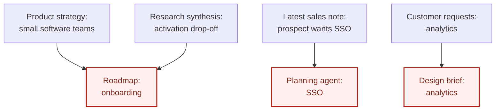
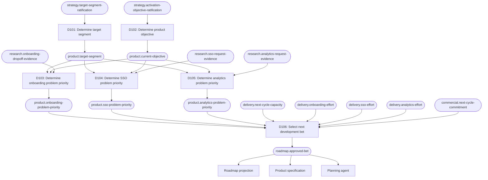

# Product development: choosing and shipping a product bet

This example follows a product team from conflicting signals to one authoritative
development commitment. It shows how Decision Engineering keeps strategy, research,
planning, implementation, and launch work aligned without pretending that product
judgment can be automated away.

The example is intentionally broader than a prioritization score. Its subject is the
decision system around a product bet: where the answer comes from, who may change it,
how other work consumes it, and what happens when new evidence changes the answer.

## The situation

Relay is a fictional collaboration product for small software teams. The team has one
six-week development cycle available and three plausible initiatives:

- Improve onboarding after repeated evidence that new workspaces fail to invite a
  second teammate.
- Build enterprise SSO after one large prospect asks for it.
- Add project analytics after several existing customers request better reporting.

The team's current strategy targets software teams with 20–100 employees, and its
current objective is to improve workspace activation. Research strongly connects the
onboarding problem to that objective. Analytics has moderate supporting evidence. SSO
has weak relevance to the current target segment, but it dominates the latest sales
meeting notes.

Different parts of the organization begin to act on different interpretations:

- The roadmap still says onboarding.
- A planning agent reads the newest meeting note and recommends SSO.
- Design starts exploring analytics.
- Engineering estimates all three, but does not know which one is committed.

None of these actions is irrational in isolation. The surprise exists because no
authoritative decision owns the answer to this question:

> Which product bet receives the next development cycle?

## Before: the decision is hidden in its consumers

Without an explicit owner, each consumer reconstructs the product decision from the
documents it happens to see:



The roadmap, planning agent, and design brief are all making the same decision. They
may agree today and diverge tomorrow because the policy is duplicated and none of the
three outputs is authoritative.

## Requirement

> The team must commit its next development cycle to one product bet that advances the
> current product objective, respects binding commitments, and fits available capacity.

The requirement says what must become true. It does not yet say which initiative wins
or prescribe a scoring method.

## Map the decisions before choosing

"What should we build?" hides several independently changeable questions. A small
decision map makes those questions and their outputs explicit:



This decomposition preserves several distinctions:

- Target segment is not silently re-decided while ranking initiatives.
- Problem priority and development commitment are separate. A high-priority problem
  may still be too large for the available cycle.
- Signed commitments have a different authority from meeting notes or sales interest.
- The roadmap, product specification, and planning agent consume the approved bet;
  they do not select it again.

The IDs are illustrative. A real project must locate its existing decisions and facts
before creating new records.

## The central decision record

The following record expands D106, the decision that was previously scattered across
the roadmap, meeting notes, and planning prompts.

```markdown
---
status: active
domain: roadmap
id: D106
title: "Select next development bet"
updated_at: 2026-09-04
---

## Requirement

The team must commit its next development cycle to one product bet that advances the
current product objective, respects binding commitments, and fits available capacity.

## Question

Which product bet, if any, is approved for the next development cycle?

## Input facts

- `product.onboarding-problem-priority`
  - Kind: derived
  - Produced by: D103
- `product.sso-problem-priority`
  - Kind: derived
  - Produced by: D104
- `product.analytics-problem-priority`
  - Kind: derived
  - Produced by: D105
- `delivery.next-cycle-capacity`
  - Kind: root
  - Authority: engineering planning review
- `delivery.onboarding-effort`
  - Kind: root
  - Authority: engineering estimation review
- `delivery.sso-effort`
  - Kind: root
  - Authority: engineering estimation review
- `delivery.analytics-effort`
  - Kind: root
  - Authority: engineering estimation review
- `commercial.next-cycle-commitment`
  - Kind: root
  - Authority: signed-contract registry

## Invariants

- An approved result names exactly one initiative; a needs-review result names none.
- An approved initiative fits within `delivery.next-cycle-capacity`.
- Sales interest or meeting notes cannot be treated as a binding commercial
  commitment.
- An unresolved tie or an infeasible binding commitment cannot produce an approved
  result.

## Policy

- If `commercial.next-cycle-commitment` names an initiative and that initiative fits
  within capacity, approve the committed initiative.
- If a binding commitment exists but does not fit within capacity, return
  `needs_review`; do not silently displace it or approve infeasible work.
- When no binding commitment exists, exclude every initiative whose estimated effort
  exceeds capacity.
- From the remaining initiatives, approve the only initiative with the highest
  problem priority, ordered `high`, `medium`, then `low`.
- If no initiative remains or more than one initiative shares the highest priority,
  return `needs_review` for product leadership adjudication.

The binding-commitment policy takes precedence. Capacity remains a hard constraint in
every branch.

## Output fact

- Name: `roadmap.approved-bet`
- Meaning: The one initiative currently authorized to consume the next development
  cycle, or that human review is required before any initiative is authorized.
- Shape: `{ state: approved | needs_review, initiative: onboarding | sso | analytics | none, reason: string }`
- Atomicity: `initiative` identifies the subject of `state`, and `reason` explains that
  same result; neither is meaningful as a separate authoritative conclusion.

## Enforcement

The roadmap commitment boundary must reject moving an initiative into committed
delivery unless it matches an `approved` result in `roadmap.approved-bet`. Work intake
must reject cycle-scoped implementation tickets that cite a different initiative.

## Verification

- With no binding commitment, approve the unique highest-priority initiative that fits
  within capacity.
- Exclude an initiative whose estimate exceeds capacity even when its problem priority
  is highest.
- Approve a binding committed initiative when it fits within capacity, regardless of
  the relative problem priorities.
- Return needs-review when a binding commitment exceeds capacity.
- Return needs-review when feasible initiatives tie for highest priority.
- Return needs-review when no initiative is feasible.
- Reject committing a roadmap initiative that differs from the approved output.
- Reject cycle-scoped implementation tickets for an unapproved initiative.
```

In the initial scenario, there is no signed commitment. All three initiatives fit in
the cycle, and their problem priorities are:

| Initiative | Priority | Why |
| --- | --- | --- |
| Onboarding | High | Strong evidence tied to the current activation objective |
| Analytics | Medium | Repeated requests, but weaker connection to the objective |
| SSO | Low | One prospect request outside the current target segment |

D106 therefore produces:

```text
roadmap.approved-bet = {
  state: approved,
  initiative: onboarding,
  reason: "Unique highest-priority feasible initiative; no binding commitment exists."
}
```

The policy is deliberately simple for the example. A real team may add opportunity
cost, confidence, strategic options, or risk, but each additional input still needs an
authority and every conflict still needs an explicit resolution rule.

## Record the decision model's semantic change

Creating D106 changes the system's intended decision architecture, so it receives a
semantic log entry:

```markdown
## [2026-09-04] create | D106 | Select next development bet

Reason:
The next-cycle product bet had no authoritative owner. Roadmaps, notes, and agents
were selecting initiatives independently.

Changed:
- Added D106 producing `roadmap.approved-bet`.
- Declared problem-priority facts, delivery estimates, cycle capacity, and binding
  commercial commitment as its inputs.
- Made the roadmap commitment boundary and work intake responsible for enforcement.

Affected:
- `roadmap.approved-bet`
- Roadmap projection
- Product specification
- Cycle-scoped implementation tickets
- Planning-agent context
- D106 policy-branch and enforcement verification
```

The ledger's index and generated graph must then be refreshed from the accepted
record. The log captures the change to intended decision semantics; it is not a log of
every value the decision produces while the system runs.

## Consume the answer instead of re-deciding it

Once D106 owns `roadmap.approved-bet`, downstream artifacts have narrower jobs:

| Consumer | Responsibility | What it must not do |
| --- | --- | --- |
| Roadmap | Project the approved initiative and decision ID | Rank the candidates again |
| Product specification | Define the approved initiative's behavior and boundaries | Substitute another initiative |
| Planning agent | Plan work for the approved initiative | Infer priority from recent notes |
| Engineering intake | Admit tickets for the approved initiative | Treat ticket creation as approval |
| Launch planning | Prepare messaging for the approved initiative | Reinterpret the target segment |

A meeting note can still contain valuable evidence. It can update an authoritative root
fact through its owning process, but recency alone does not give the note authority to
override a decision.

Implementation work should cite the decision that authorizes it rather than copy the
policy:

```text
Decision: D106
Consumes: roadmap.approved-bet = onboarding
```

Copying the prioritization rules into a roadmap template, prompt, or ticket validator
would create another implementation of D106 and restore the original failure mode.

## When new information changes the answer

Two weeks later, Relay signs an enterprise contract that requires SSO in the next
cycle. The meeting note does not become authoritative. Instead, the signed-contract
registry changes the root fact:

```text
commercial.next-cycle-commitment:
  before = none
  after  = sso
```

If the SSO estimate fits within capacity, D106 is reevaluated and now produces:

```text
roadmap.approved-bet = {
  state: approved,
  initiative: sso,
  reason: "Binding next-cycle commitment; estimated work fits within capacity."
}
```

The change has a bounded blast radius:

- D103–D105 do not change. Onboarding can remain the highest-priority customer
  problem even though SSO becomes the approved development commitment.
- D106 changes because one of its declared inputs changed.
- Decisions about release scope, launch readiness, and rollout that consume
  `roadmap.approved-bet` must be revisited.
- The roadmap, product specification, implementation tickets, and planning-agent
  context must refresh their projections.
- Unrelated product decisions remain untouched.

This value change does not edit D106 or add an entry to the ledger's semantic
`log.md`: the question, inputs, policies, invariants, output meaning, enforcement, and
verification remain the same. A runtime or product audit log may record the input and
output values. The semantic log changes only if the team changes the decision model—for
example, by deciding that signed commitments require leadership review instead of
automatically taking precedence.

This is the correction mechanism: new information changes one authoritative input,
the graph identifies the decision to reevaluate, and its downstream edges define the
review surface.

## Trace a wrong downstream action

Suppose a planning agent creates an SSO specification before the contract is signed,
while `roadmap.approved-bet` still says onboarding.

Trace the observation backward:

```text
Observed SSO specification
→ planning agent input
→ latest sales meeting note
→ no dependency on roadmap.approved-bet
```

D106 may be completely correct. The defect is a hidden dependency in the consumer:
the planning agent used a non-authoritative note to repeat D106's judgment.

The repair is to make the agent consume `roadmap.approved-bet` and use meeting notes
only as evidence routed through the appropriate authority. Adding stronger
prioritization instructions to the prompt would merely create another copy of the
policy.

## What Decision Engineering contributed

Decision Engineering did not prove that onboarding was the objectively best product
bet. Product research, estimation, strategic judgment, and leadership accountability
are still necessary.

It did make several things reliable:

- One decision owns the development commitment.
- Strategy, evidence, capacity, and commitments enter through named authoritative
  facts.
- Conflicts and precedence are explicit instead of being resolved by document recency.
- Roadmaps, specifications, agents, and tickets consume the answer without recreating
  it.
- New information has a visible path into the decision and a bounded downstream impact.
- A wrong result or wrong consumer has a specific address from which correction can
  begin.

The resulting product-development loop is:

```text
signals → authoritative facts → explicit product decision → coordinated execution
       → observed outcomes → corrected facts or policy → next decision
```

Observed outcomes should return through named observation boundaries. They may change
the evidence or policy used by the next decision, but they should not silently rewrite
the historical reason the previous bet was approved.

## Apply this pattern to another product decision

Start with a behavior-shaping question that several people, documents, or agents must
answer consistently. Good candidates include:

- Which customer problem is currently prioritized?
- Is this initiative eligible for roadmap consideration?
- Which product bet is approved for the next cycle?
- Is this capability required for the first release?
- Is this release ready to launch?
- Should this rollout expand, pause, or reverse?

For each question, locate an existing owner before creating a new record. Then identify
the authoritative inputs, the one independently decidable output fact, the policies and
invariants, the enforcement boundary, and the checks that would reveal divergence.
