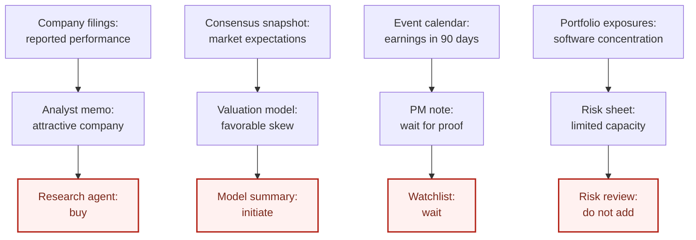
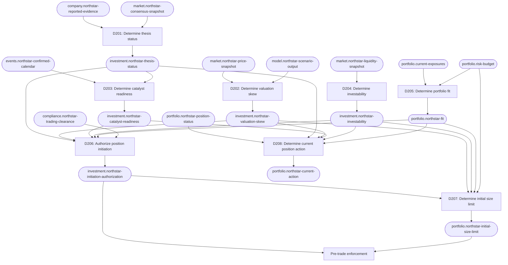

# Public markets: making and managing an equity investment

This example follows an investment team from a promising company thesis to an
authorized public-equity position. It shows how Decision Engineering separates
research conclusions, valuation, catalysts, investability, portfolio fit,
authorization, sizing, and ongoing position management.

The company, security, ticker, prices, estimates, and events in this document are
fictional. They are illustrative assumptions, not current market data or an investment
recommendation.

## The situation

Northstar Cloud is a fictional listed software company with the fictional ticker
`EXMPL`. Its shares trade at an assumed price of `$40` at the team's research freeze
time. An analyst believes that the market underestimates how quickly Northstar's
enterprise product can improve growth and free-cash-flow margins.

Several conclusions now coexist:

- The analyst's memo says the thesis is attractive.
- The valuation model shows favorable scenario-weighted returns.
- The portfolio manager wants a near-term catalyst before allocating capital.
- The risk sheet shows that the portfolio already has meaningful software exposure.
- A research agent sees the upside case and says "buy."

These statements answer different questions. Treating any one of them as the final
investment decision hides the other conditions that must hold before the portfolio may
act.

The behavior-shaping question is:

> May the fund initiate a long position in Northstar Cloud common equity now?

## Before: research conclusions become accidental trade authority

When the authorization decision has no owner, each artifact can quietly turn its own
analysis into an action:



The memo, model, watchlist, and risk review contain useful facts and judgments, but none
should independently authorize a trade. Otherwise the final action depends on which
document or agent is consulted.

## Requirement

> The portfolio may initiate a position only when a falsifiable variant thesis,
> attractive valuation skew, an observable catalyst path, security investability,
> portfolio fit, and trading clearance all support acting at the same time.

This requirement does not say Northstar must be purchased. It defines what must be true
before capital can be committed.

## Decompose "should we invest?"

The apparent yes-or-no question contains conclusions that can change independently:

| Decision | Question | Output fact |
| --- | --- | --- |
| D201 | Is the variant thesis currently supported? | `investment.northstar-thesis-status` |
| D202 | Does the stock's current valuation offer acceptable scenario skew? | `investment.northstar-valuation-skew` |
| D203 | Is there a credible, observable catalyst path within the investment horizon? | `investment.northstar-catalyst-readiness` |
| D204 | Can the security be entered and exited within the mandate's liquidity and implementation constraints? | `investment.northstar-investability` |
| D205 | Does this idea fit the portfolio's current exposures and risk budget? | `portfolio.northstar-fit` |
| D206 | May the fund initiate the long position now? | `investment.northstar-initiation-authorization` |
| D207 | What is the maximum initial position size? | `portfolio.northstar-initial-size-limit` |
| D208 | For an existing position, should the fund add, hold, trim, or exit? | `portfolio.northstar-current-action` |

These must remain separate:

- A sound company thesis can coexist with an unattractive stock price.
- Attractive valuation can coexist with no catalyst and a long wait for evidence.
- An investable security can still be a poor fit for the current portfolio.
- Authorization to initiate does not determine position size.
- An initiation decision does not govern a position forever; current-position action is
  a separate recurring decision.

## The decision graph

The investment decision consumes conclusions from specialized decisions rather than
re-performing their analysis:



The diagram omits many possible facts to stay readable. A real implementation may also
need mandate restrictions, factor exposure, ownership and crowding, tax constraints,
currency exposure, options data, or benchmark effects. Each belongs only when it can
materially change a decision.

## Give each source a narrow authority

Source authority is specific to a fact. A company filing can own what the company
reported; it cannot own whether the stock is attractive.

| Fact type | Example authority or observation boundary | Does not own |
| --- | --- | --- |
| Reported revenue, margin, and KPI history | Filed company reports | Forecasts or investment conclusions |
| Management guidance | Dated company guidance | Whether guidance is credible |
| Consensus estimates | Named consensus snapshot with freeze time | The team's variant thesis |
| Current price and liquidity | Named market-data snapshot with freeze time | Fair value |
| Scenario assumptions | Versioned investment model | Authorization to trade |
| Current positions and exposures | Portfolio accounting and risk system | Thesis validity |
| Trading restrictions | Compliance control system | Investment merit |

Analyst notes and meeting transcripts may supply evidence, interpretation, or
provenance. Recency, confidence, or authorship alone does not make them authoritative
for the final action.

## Illustrative upstream conclusions

At the research freeze time, the fictional upstream decisions produce:

| Output fact | State | Evidence posture |
| --- | --- | --- |
| `investment.northstar-thesis-status` | `supported` | Reported customer retention and margin evidence support a falsifiable variant view |
| `investment.northstar-valuation-skew` | `attractive` | Scenario model clears the fund's return and downside hurdles at the assumed `$40` price |
| `investment.northstar-catalyst-readiness` | `ready` | Two scheduled earnings reports can test retention and margin claims within nine months |
| `investment.northstar-investability` | `investable` | Illustrative liquidity and implementation checks pass for the contemplated size |
| `portfolio.northstar-fit` | `approved` | The proposed exposure remains within the fictional portfolio's software and single-name limits |
| `compliance.northstar-trading-clearance` | `cleared` | Illustrative clearance is current at the decision time |

The valuation conclusion is based on explicit fictional assumptions:

| Scenario | Probability | Price target | Return from `$40` | What would drive it |
| --- | ---: | ---: | ---: | --- |
| Downside | 25% | `$30` | -25% | Retention weakens and margin improvement stalls |
| Base | 50% | `$56` | +40% | Retention stabilizes and margins improve as expected |
| Upside | 25% | `$68` | +70% | Enterprise adoption and operating leverage exceed expectations |

The probability-weighted illustrative value is `$52.50`, or 31.25% above the assumed
price. D202, not D206, owns the policy that determines whether this skew is attractive.
The figures screen the decision logic; they are not sourced valuation targets.

## The central decision record

D206 combines the independently owned conclusions into one authorization fact.

```markdown
---
status: active
domain: investment-authorization
id: D206
title: "Authorize Northstar position initiation"
updated_at: 2026-09-04
---

## Requirement

The portfolio may initiate a Northstar Cloud long position only when a falsifiable
variant thesis, attractive valuation skew, an observable catalyst path, security
investability, portfolio fit, and trading clearance all support acting at the same
time.

## Question

May the fund initiate a long position in Northstar Cloud common equity now?

## Input facts

- `investment.northstar-thesis-status`
  - Kind: derived
  - Produced by: D201
- `investment.northstar-valuation-skew`
  - Kind: derived
  - Produced by: D202
- `investment.northstar-catalyst-readiness`
  - Kind: derived
  - Produced by: D203
- `investment.northstar-investability`
  - Kind: derived
  - Produced by: D204
- `portfolio.northstar-fit`
  - Kind: derived
  - Produced by: D205
- `compliance.northstar-trading-clearance`
  - Kind: root
  - Authority: compliance control system

## Invariants

- A blocked or expired compliance clearance can never produce authorization.
- Authorization requires every analytical input to be current under its producing
  decision's freshness policy.
- Authorization does not determine position size or permit an order above the
  separately owned size limit.
- A supported company thesis cannot compensate for unattractive valuation,
  non-investability, or rejected portfolio fit.
- Missing or conflicting required facts cannot produce authorization.

## Policy

- If trading clearance is `blocked`, return `prohibited`.
- If trading clearance or any derived input is missing, conflicting, or stale, return
  `needs_review`.
- If thesis status is `invalidated`, investability is `not_investable`, or portfolio
  fit is `rejected`, return `pass`.
- If the thesis remains supported but valuation is not attractive or catalyst readiness
  is not ready, return `watchlist`.
- Return `authorized` only when thesis status is `supported`, valuation skew is
  `attractive`, catalyst readiness is `ready`, investability is `investable`, portfolio
  fit is `approved`, and trading clearance is `cleared`.

Apply the branches in the order above. Compliance prohibition takes precedence over
analytical conclusions, and uncertainty takes precedence over authorization.

## Output fact

- Name: `investment.northstar-initiation-authorization`
- Meaning: Whether the fund may currently initiate the specified Northstar Cloud long
  position under the declared investment, portfolio, implementation, and compliance
  conditions.
- Shape: `{ state: authorized | watchlist | pass | prohibited | needs_review, reason: string }`
- Atomicity: `reason` explains the authorization state and cannot change independently
  without misrepresenting it.

## Enforcement

The pre-trade approval boundary must reject a Northstar Cloud buy order unless
`investment.northstar-initiation-authorization.state` is `authorized` and all inputs
remain within their declared freshness windows. The order-control boundary must
separately reject an order that would exceed `portfolio.northstar-initial-size-limit`.

## Verification

- Return prohibited whenever trading clearance is blocked, regardless of analytical
  conclusions.
- Return needs-review when any required input is missing, conflicting, or stale.
- Return pass when the thesis is invalidated.
- Return pass when the security is not investable or portfolio fit is rejected.
- Return watchlist when the thesis is supported but valuation is not attractive.
- Return watchlist when the thesis is supported and valuation is attractive but the
  catalyst path is not ready.
- Return authorized only when every required state is affirmative and current.
- Reject order entry for every output other than authorized.
- Reject an authorized order that exceeds the independently produced size limit.
- Recheck time-sensitive inputs at the pre-trade boundary rather than relying on a
  previously cached authorization.
```

With the illustrative upstream states, D206 produces:

```text
investment.northstar-initiation-authorization = {
  state: authorized,
  reason: "Thesis, valuation, catalyst, investability, portfolio fit, and clearance are current and affirmative."
}
```

This answer authorizes consideration of an order. It does not say how much to buy.

## Size the position separately

D207 consumes the authorization, downside scenario, portfolio risk budget, liquidity,
and concentration limits. In this fictional example it produces:

```text
portfolio.northstar-initial-size-limit = {
  state: approved,
  maximum_nav_percent: 1.5,
  reason: "A 25% downside at 1.5% of NAV uses 37.5 basis points of the approved loss budget."
}
```

The quantity and rationale form one size-limit fact because the rationale explains the
limit. Authorization and size remain separate because either can change while the
other remains valid. The execution boundary must read both.

## Record the decision model's semantic change

Creating the authorization decision changes the system's intended architecture, so it
receives a semantic log entry:

```markdown
## [2026-09-04] create | D206 | Authorize Northstar position initiation

Reason:
Research, valuation, catalyst, risk, portfolio, and compliance artifacts had no single
authoritative decision that determined whether the fund could initiate the position.

Changed:
- Added D206 producing `investment.northstar-initiation-authorization`.
- Declared five derived analytical inputs and one root compliance input.
- Separated initiation authorization from the D207 size limit and D208 current-position
  action.

Affected:
- `investment.northstar-initiation-authorization`
- D207 — Determine Northstar initial size limit
- Pre-trade approval and order-control boundaries
- Research-agent action output
- Investment committee view
- D206 policy-branch, freshness, and enforcement verification
```

The ledger index and graph are refreshed from the accepted decision records. Runtime
changes in price, evidence, clearance, or portfolio exposure are not semantic ledger
edits unless they change the decision model itself.

## Consume the authorization without recreating it

Downstream consumers should use D206's output for its declared meaning:

| Consumer | Correct responsibility | Must not do |
| --- | --- | --- |
| Investment committee view | Display the current authorization and its producing decision | Recalculate authorization from memo excerpts |
| Research agent | Explain or monitor the authoritative state | Turn an attractive thesis directly into `buy` |
| Sizing decision | Determine the maximum initial size after authorization | Decide whether the thesis is valid |
| Pre-trade control | Enforce current authorization and freshness | Invent analytical thresholds |
| Order control | Enforce the independently owned size limit | Treat authorization as unlimited sizing authority |

The model, memo, and dashboard remain important projections and evidence surfaces.
They should cite decision IDs and facts rather than copy the policies that produce
them.

## When the price changes before execution

Assume Northstar rises from `$40` to `$55` before the order is entered, while the
company evidence and scenario targets remain unchanged.

The market-data observation boundary updates its time-stamped price fact. D202 then
re-evaluates the valuation skew. The same targets now imply:

| Scenario | Target | Return from `$55` |
| --- | ---: | ---: |
| Downside | `$30` | -45.5% |
| Base | `$56` | +1.8% |
| Upside | `$68` | +23.6% |

D202 changes `investment.northstar-valuation-skew` from `attractive` to
`not_attractive`. D206 consequently changes the authorization state from `authorized`
to `watchlist`, and the pre-trade boundary rejects the order.

No ledger record or semantic log entry is required. The facts changed, but the
questions, authorities, policies, invariants, output meanings, enforcement, and
verification did not. A separate investment audit log may preserve the evaluated input
and output values.

If the investment committee instead changes the return hurdle or valuation policy,
that is a semantic edit to D202. Its log entry would identify D206, D207, execution
controls, and their verification as downstream review targets.

## Manage an existing position through a different decision

Suppose the fund entered the position at `$40`. The initiation decision answered a
historical question and must not become permanent authority to hold the security.

D208 owns the current action for an open position. It can consume current thesis,
valuation, catalyst, position, and portfolio facts to produce one of `add`, `hold`,
`trim`, `exit`, or `needs_review`.

For example, the original thesis may specify this falsifier:

> Exit if reported enterprise net revenue retention remains below the thesis threshold
> for two consecutive reporting periods and management does not provide independently
> supported evidence that the decline is temporary.

If that evidence arrives, D201 changes the thesis status to `invalidated`. D208 then
produces `exit` under its own policy. A falling share price alone does not prove the
thesis wrong, and a rising price alone does not prove it right; each observation enters
through the decision it can legitimately affect.

This makes action discipline explicit before the emotional pressure of a gain or loss.

## Trace a wrong investment action

Suppose a research agent recommends initiating Northstar while D206 says `watchlist`.
Trace the observed action backward:

```text
Observed recommendation: initiate
→ research-agent prompt
→ analyst memo and upside scenario
→ no dependency on investment.northstar-initiation-authorization
```

The thesis and valuation decisions may both be correct. The defect is that the agent
treated two favorable inputs as trade authority and bypassed catalyst, portfolio,
investability, freshness, and compliance decisions.

The repair is to make the agent consume D206's output. Copying D206's rules into the
prompt would introduce another implementation of the authorization policy and allow it
to drift.

## Separate decision quality from investment outcome

Public-market outcomes are noisy. A well-engineered decision can lose money, and a
poorly engineered decision can make money.

Review the process by asking:

- Were the input facts correct and current at the recorded decision time?
- Were assumptions clearly distinguished from reported facts, consensus, and market
  data?
- Did each producing decision apply its authoritative policy?
- Were scenario probabilities, downside mechanisms, catalysts, and falsifiers explicit?
- Did authorization, sizing, and execution controls consume the authoritative outputs?
- Did new evidence enter through the correct fact and trigger downstream reevaluation?

P&L remains an essential outcome, but it is not enough to identify which decision, fact,
or policy should be corrected.

## What Decision Engineering contributed

Decision Engineering did not discover a profitable security or eliminate investment
judgment. It made the path from evidence to portfolio action inspectable and
correctable:

- Company thesis and stock thesis are not conflated.
- Time-sensitive facts carry explicit authorities and freshness obligations.
- Valuation, catalyst, investability, portfolio fit, and compliance cannot be skipped
  by a persuasive memo or agent.
- Authorization and sizing have separate owners and enforcement boundaries.
- An initiation decision does not silently become a permanent hold decision.
- Changes in price or evidence have visible downstream consequences without rewriting
  historical intent.
- A wrong action can be traced to a specific decision or a consumer that bypassed it.

The resulting loop is:

```text
reported facts + market facts + assumptions
                    ↓
      thesis + valuation + catalyst + risk
                    ↓
         authorization → size → execution
                    ↓
       new evidence → hold / add / trim / exit
```

## Apply this pattern to another investment decision

Start with a question whose answer changes portfolio behavior and must remain
consistent across people, agents, models, and controls. Good candidates include:

- Is the variant thesis currently supported?
- Is the security attractively valued at the current price and freeze time?
- Is the catalyst path sufficient for the intended horizon?
- Is the security investable under liquidity and mandate constraints?
- Does the position fit the portfolio's present risk budget?
- May the portfolio initiate or add now?
- What is the maximum position size?
- Should the current position be held, added to, trimmed, hedged, or exited?

For each question, locate an existing output fact and owner before creating a decision.
Then name the authoritative inputs, time boundaries, policy, falsifiers, output fact,
enforcement boundary, and verification obligations. Keep facts, assumptions, model
outputs, and portfolio judgments distinct enough that any one can be corrected without
silently rewriting the others.
